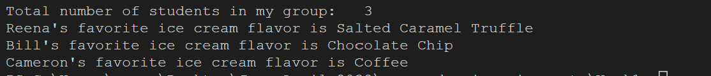

# Breakout Room Activity

## 1. Create a HashMap - https://login.codingdojo.com/m/325/9567/64526
## 2. Store favorite icecream flavors of your group in hashmap
## 3. Display how many students are there in your group.
## 4. Display Student name and their favorite ice cream flavor. 

